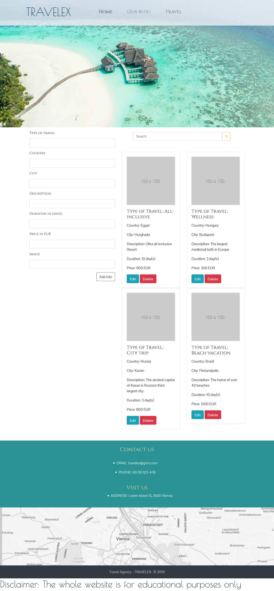

# Bootcamp: Angular CodeReview-7 "Travelex"

  

  
Layout of "Blogs" & "Travel" pages

   Blogs page  
  

    
  

   Travel page  
  

    
  

This project was generated with [Angular CLI](https://github.com/angular/angular-cli) version 8.3.12. 

The travel agency app contains static content on the landing and blogs pages.

The travel page has the list of all available trips, live-search and the form with validation and the option to add, delete and update travel information.

The data is stored in the Firebase database.

**// Disclaimer: The whole website is for educational purposes only //**

## Development server

Run `ng serve` for a dev server. Navigate to `http://localhost:4200/`. The app will automatically reload if you change any of the source files.

## Code scaffolding

Run `ng generate component component-name` to generate a new component. You can also use `ng generate directive|pipe|service|class|guard|interface|enum|module`.

## Build

Run `ng build` to build the project. The build artifacts will be stored in the `dist/` directory. Use the `--prod` flag for a production build.

## Running unit tests

Run `ng test` to execute the unit tests via [Karma](https://karma-runner.github.io).

## Running end-to-end tests

Run `ng e2e` to execute the end-to-end tests via [Protractor](http://www.protractortest.org/).

## Further help

To get more help on the Angular CLI use `ng help` or go check out the [Angular CLI README](https://github.com/angular/angular-cli/blob/master/README.md).
